# Solar resource prediction for EV charging

This report walks through every part of the project and explains each piece in the context
it was built for. The context is a conference paper with two contributions: predicting the
solar resource with machine learning, and ranking locations to site solar-powered EV charging
stations. For each analysis the report says what it is, why it belongs in the paper, and what
it means for an actual charger. All numbers come from real Open-Meteo data and real model
runs, and the source file is named for each one so it can be traced.

## 1. The paper, and what this work supplies

The paper has two contributions, set in the project meeting and decoded from the brief.

1. Compare several machine-learning models at predicting solar power generation potential.
   In practice that means predicting global horizontal irradiance (GHI), the solar resource,
   and converting it to PV power. The student supplies the benchmark and figures; the
   instructor writes the prose.
2. Rank locations by solar suitability across the year and identify good sites for
   solar-powered EV charging stations, within one city where the resource varies.

Several decisions were fixed in the brief and they shape everything below. The method is
machine learning; the naive baselines stay only as the reference a solar forecast is scored
against, not as an open question about whether ML is worthwhile. The study city is chosen from
the data, where intra-city variation actually exists. The data source is Open-Meteo. No result
is fabricated, so a weak number is reported as it is.

The brief also named four figures the paper needs: a model-comparison bar chart, a GHI
heatmap, a GHI and solar-potential time series, and a suitability-ranking chart. All four are
delivered (fig1, fig2b/fig2c, fig3b, fig4b), with the rest of the figures extending them.

Everything that follows maps to one of the two contributions. Sections 2 and 3 supply
contribution 1 (predicting the resource); section 4 supplies contribution 2 (ranking and
siting). Section 5 covers how the work was built so the paper is reproducible.

## 2. The data everything stands on

Both contributions stand on one record: hourly GHI and weather for a set of Pakistani cities.
GHI is the broadband irradiance on a horizontal surface, in W/m². It is the quantity that sets
a flat panel's output, which is why it is both the thing the models predict in contribution 1
and the basis for ranking sites in contribution 2. Air temperature enters because a hot panel
loses efficiency, so it shapes the power a charger actually delivers (section 4.6).

The data is ERA5, ECMWF's reanalysis, served hourly through the Open-Meteo Historical Archive
(free, no key). ERA5 assimilates observations into a fixed model cycle and distributes surface
fields on a 0.25° grid, so it is a physically consistent, gap-free series, which is what the
sequence models need. We fetch five hourly variables per location: GHI (`shortwave_radiation`),
temperature, relative humidity, wind speed, and cloud cover. Five years per location, roughly
43,800 hourly records each, which is long enough to carry both the seasonal cycle and the
year-to-year variation the siting work needs.

Seven cities cover the country's climate range: Karachi on the coast, Lahore and Multan on the
plains, Islamabad and Peshawar in the north-west, Quetta in the western high desert, and Gilgit
in the mountains. That spread is deliberate. For contribution 1 it lets us test whether the
best model is the same across resource regimes; for contribution 2 it is the inter-city ranking
itself.

The archive returns a full multi-year series for a point in one request, so the call count
scales with the number of locations, not days. Open-Meteo prices a request by variables times
days, so a five-year five-variable pull is heavy enough to trip the per-minute limit. The
fetcher splits each location into one-year chunks, backs off and retries on a limit error, and
caches every location to a Parquet file keyed by site, range, and variable set, so nothing is
fetched twice. The data layer sits behind one interface, so the archive could later be swapped
for a live database without touching the analysis.

One property of ERA5 matters for how strongly the siting claims can be made. The grid is coarse,
about 25 km for radiation. Between cities, separated by hundreds of kilometres, the contrasts
are fully resolved, so the inter-city ranking is solid. Within a city, which spans only a
handful of cells, the contrast is small, on the order of 5%, so the intra-city work is a ranking
of coarse cells and an interpolated surface rather than a claim about individual streets. ERA5
is also a reanalysis, not a ground measurement, so the numbers are physically sensible but
unvalidated against a local sensor.

## 3. Predicting the solar resource (contribution 1)

A solar-powered charger's output is the resource itself, so forecasting GHI is what lets an
operator schedule charging, decide when to lean on storage or the grid, and commit to a
day-ahead plan. The paper's first contribution is to find which model predicts the resource
best, and the rest of this section is that benchmark plus the experiments that make it
credible and useful.

### 3.1 How a forecast is scored, and why this rigor

Solar forecasting has a standard way of being measured, and the paper needs to use it or the
results will not be taken seriously. Four choices make up that rigor.

A clear-sky model gives the GHI expected with no clouds, from solar geometry alone (we use
pvlib's Haurwitz model). It does two jobs. It defines the night mask: at night clear-sky GHI is
near zero, and those hours are dropped from every metric, because the long runs of correctly
predicted night-time zeros otherwise inflate R² toward 0.99 for any model and hide the real
daytime skill. It also defines the clear-sky index kt = GHI / GHI_cs, which removes the
deterministic daily and seasonal cycle and isolates the cloud-driven part that is the only hard
thing to predict.

The headline metric is the forecast skill score, S = 1 − RMSE_model / RMSE_reference. It says
how much a model beats a sensible naive forecast: 0 means no better, 0.4 means 40% lower error.
For GHI the reference is smart persistence, which carries the clear-sky index forward, the
standard reference in the field. The split is strictly chronological, training on the earlier
data and testing on the most recent 20%, never shuffled, because the strong hour-to-hour
autocorrelation would otherwise leak the answer across a shuffle. Features at the forecast time
use only past values plus terms that are deterministic at the target time (clear-sky GHI,
time-of-day); the direct and diffuse radiation components are excluded because they are an
algebraic decomposition of the target and would leak it.

### 3.2 The models, and why each tier is in the paper

The lineup is four tiers, from naive to modern, and each tier earns its place in the paper for a
reason.

| Tier | Models | Why it is in the paper |
|---|---|---|
| 0 — naive | persistence, smart (clear-sky) persistence, climatology | The reference a solar forecast is scored against |
| 1 — classical ML | Ridge, Random Forest, Extra Trees, XGBoost, LightGBM, CatBoost | The bar the modern models must clear; the workhorses of tabular forecasting |
| 2 — deep learning | LSTM, NHITS | Modern neural sequence models, one of them (NHITS) covariate-aware |
| 3 — foundation model | Chronos-2 | A 2025-generation pretrained transformer, used zero-shot; the paper's novelty hook |

The naive tier is the measuring stick, not a question about whether AI helps. The classical tier
is the bar, since gradient-boosted trees are the default for tabular forecasting. The deep and
foundation tiers are the modern methods the paper exists to test: the novelty is a reproducible
benchmark of a current foundation model against classical ML and deep learning for hour-ahead
GHI in Pakistani cities, scored as a clear-sky skill score. Including them is the point even in
the cases where a tree wins, because showing where they win and where they do not is the
contribution.

### 3.3 Which model predicts hour-ahead GHI best

Hour-ahead GHI, Karachi, five years, daytime hours. Source: `reports/benchmark_karachi.csv`.
This is the model-comparison bar chart the brief asked for.

| Model | Tier | RMSE | R² | MBE | Skill |
|---|---|---|---|---|---|
| extra_trees | classical ML | 41.6 | 0.976 | −0.4 | **0.402** |
| catboost | classical ML | 41.8 | 0.976 | 0.4 | 0.400 |
| xgboost | classical ML | 43.3 | 0.974 | 1.5 | 0.378 |
| lightgbm | classical ML | 44.0 | 0.973 | 0.7 | 0.367 |
| random_forest | classical ML | 44.5 | 0.973 | 0.4 | 0.360 |
| nhits | deep learning | 46.1 | 0.971 | 1.3 | 0.337 |
| chronos2 | foundation | 48.6 | 0.967 | 5.0 | 0.301 |
| lstm | deep learning | 52.0 | 0.963 | 3.8 | 0.253 |
| ridge | classical ML | 52.2 | 0.962 | 6.0 | 0.251 |
| smart_persistence | reference | 69.6 | 0.933 | −43.4 | 0.000 |
| climatology | naive | 82.3 | 0.906 | 5.1 | −0.183 |
| persistence | naive | 138.2 | 0.736 | −10.4 | −0.986 |

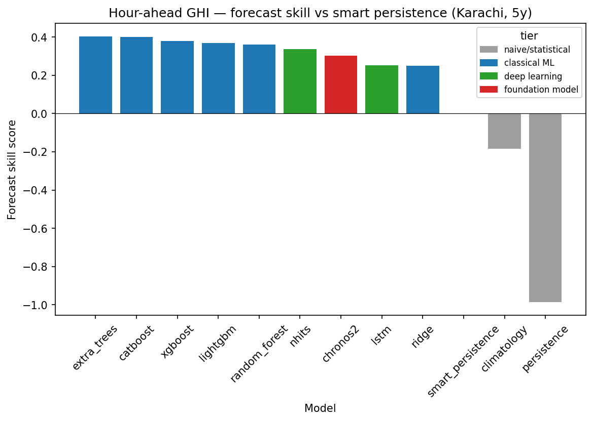

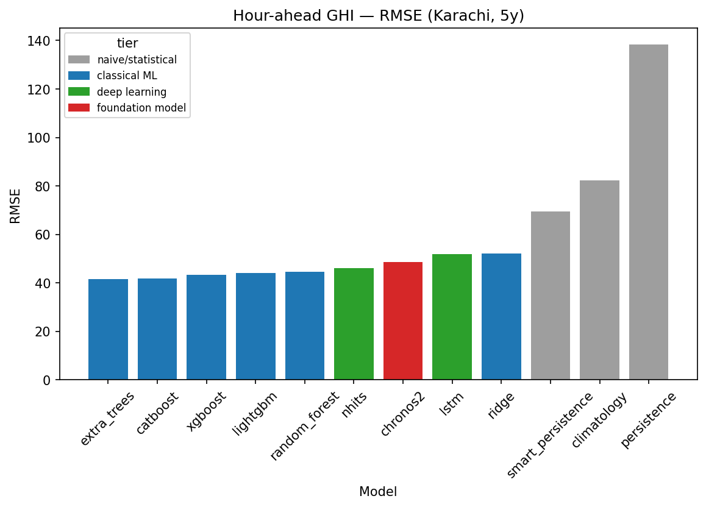

**What this shows, and what it means for a charger.** A tree ensemble predicts next-hour GHI
best, at 41.6 W/m² RMSE, a 40% lower error than the smart-persistence reference. For a charger
that is a 40% sharper picture of the next hour's solar supply than the obvious baseline gives,
which is the difference between holding charge rate steady and over- or under-drawing storage.
NHITS sits just behind the trees, and Chronos-2, with no training on Karachi at all, still
reaches 0.30 skill, ahead of the LSTM and the linear model. The MBE column shows part of why the
learned models win: the clear-sky reference runs 43 W/m² low, and every learned model pulls that
bias to near zero. GHI is this predictable one hour out because most of the signal is the solar
cycle, which the models get through clear-sky GHI, and one hour ahead the cloud field has barely
moved, so the models are smart persistence plus a learned cloud correction. The predicted-vs-
actual scatter and the feature importances below confirm that reading.

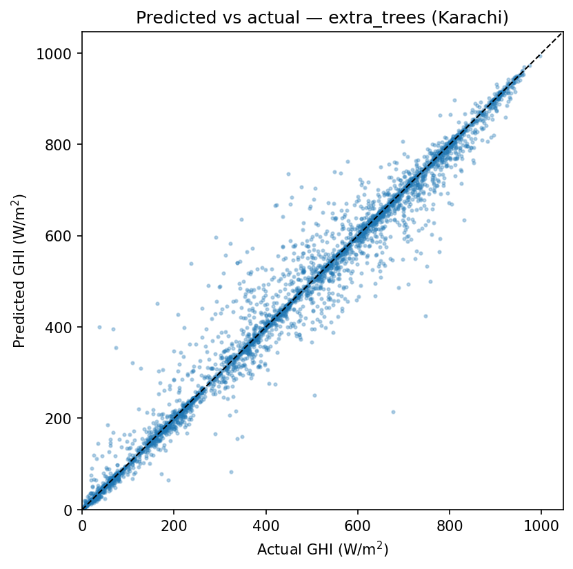

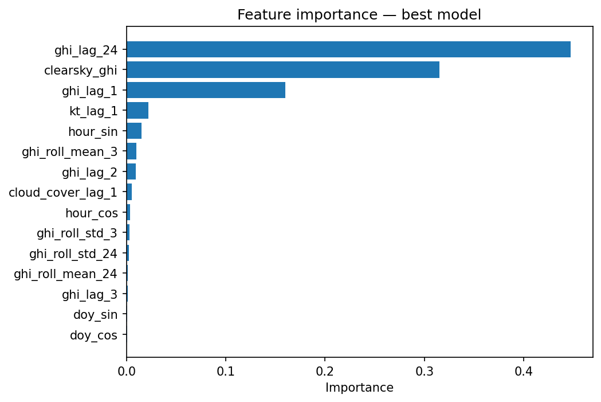

The points hug the 1:1 line and widen at high irradiance, where broken cloud makes the largest
errors, and the importances put almost all the weight on the recent GHI lags and the clear-sky
GHI. The model leans on solar geometry plus the last few hours of cloud, exactly as the skill
story says.

### 3.4 Does the finding hold across the country

A paper claim is stronger if it is not a one-city accident, so the same 12-model benchmark was
run for every city. Source: `reports/benchmark_multicity.csv`. Skill per model per city, mean
across cities in the last column.

| Model | Quetta | Multan | Peshawar | Islamabad | Karachi | Lahore | Gilgit | Mean |
|---|---|---|---|---|---|---|---|---|
| extra_trees | 0.507 | 0.434 | 0.432 | 0.393 | 0.404 | 0.380 | 0.374 | **0.418** |
| catboost | 0.482 | 0.432 | 0.439 | 0.399 | 0.401 | 0.388 | 0.374 | 0.416 |
| xgboost | 0.482 | 0.423 | 0.418 | 0.400 | 0.388 | 0.381 | 0.366 | 0.408 |
| lightgbm | 0.474 | 0.412 | 0.423 | 0.403 | 0.364 | 0.386 | 0.364 | 0.404 |
| random_forest | 0.455 | 0.393 | 0.420 | 0.386 | 0.360 | 0.364 | 0.342 | 0.388 |
| nhits | 0.420 | 0.375 | 0.329 | 0.304 | 0.340 | 0.306 | 0.277 | 0.336 |
| chronos2 | 0.381 | 0.346 | 0.229 | 0.207 | 0.304 | 0.265 | 0.260 | 0.285 |
| ridge | 0.370 | 0.335 | 0.216 | 0.211 | 0.253 | 0.238 | 0.215 | 0.263 |
| lstm | 0.354 | 0.322 | 0.255 | 0.264 | 0.195 | 0.248 | 0.204 | 0.263 |
| climatology | −0.114 | −0.082 | −0.384 | −0.329 | −0.175 | −0.386 | −0.639 | −0.301 |
| persistence | −1.211 | −1.082 | −0.861 | −0.768 | −0.986 | −0.887 | −1.005 | −0.971 |

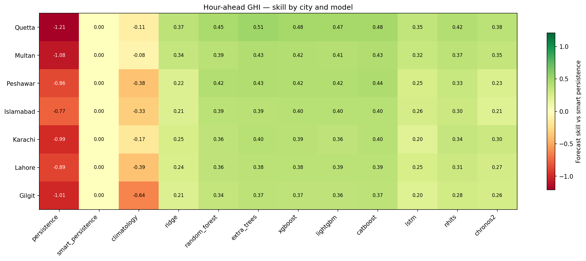

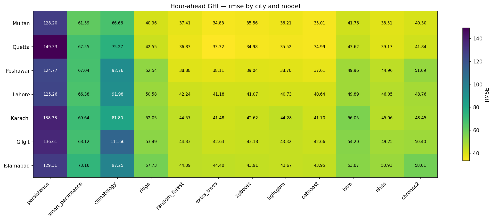

**What this shows, and what it means for the paper.** The ranking is the same in all seven
cities: a tree ensemble wins every time, from the coast to the high desert to the mountains, and
it is never the deep or foundation model. That invariance is what lets the paper state the result
as general rather than as a Karachi curiosity, and it tells an operator deploying chargers across
the country to standardise on a gradient-boosted tree. Skill tracks how learnable each city's
sky is, highest in clear-skied Quetta (0.51) and lowest in mountainous Gilgit (0.37). Chronos-2
stays positive everywhere with no local training and beats the trained LSTM, which is a strong
showing for an off-the-shelf model, though a local tree still beats it.

### 3.5 What if a new charger site has no history

An operator opening a charger in a new city has no local data to train on, so the practical
question is which model to run before a training set exists. We fixed the test set and varied the
training window from one month to four years. Source: `reports/data_efficiency_karachi.csv`.

| Model | 1 mo | 3 mo | 6 mo | 1 yr | 2 yr | 4 yr |
|---|---|---|---|---|---|---|
| chronos2 (zero-shot) | 0.301 | 0.301 | 0.301 | 0.301 | 0.301 | 0.301 |
| nhits | 0.202 | 0.271 | 0.298 | 0.332 | 0.338 | 0.336 |
| extra_trees | 0.158 | 0.189 | 0.227 | 0.394 | 0.406 | 0.410 |
| xgboost | −0.122 | 0.105 | 0.181 | 0.363 | 0.391 | 0.384 |

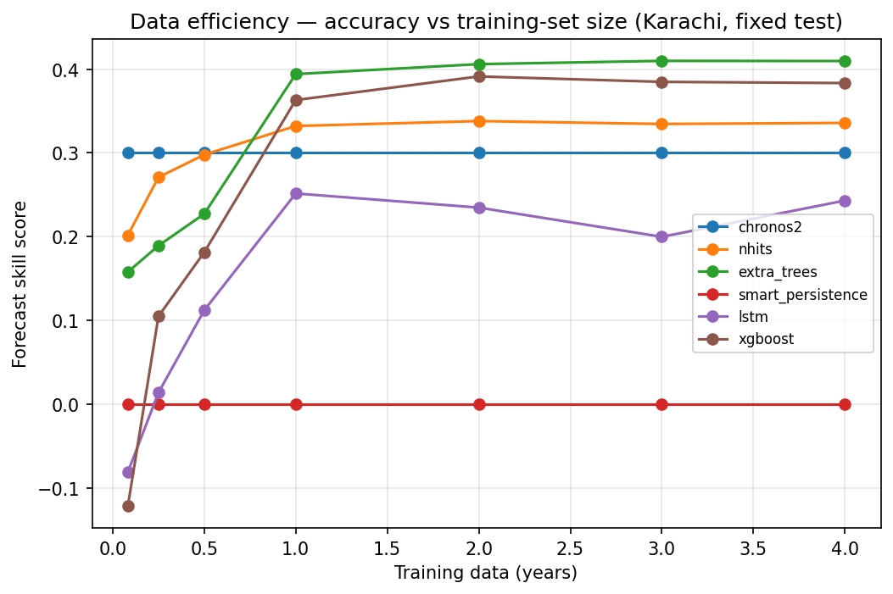

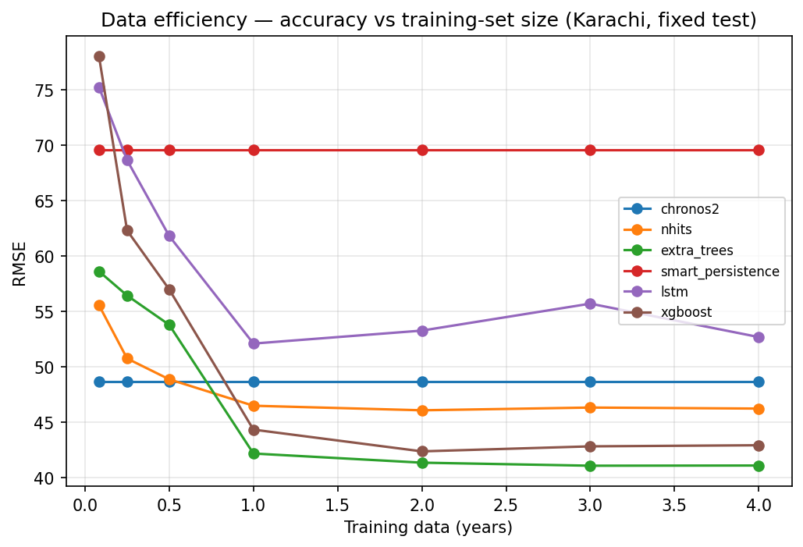

**What this shows, and what it means for a charger.** Chronos-2 is flat because it never trains,
and it is the best model in the table at three months or less; XGBoost is actually worse than the
naive reference at one month. The trees overtake only once they have about a year of data. So the
deployment rule for a new charger site is concrete: run the foundation model or NHITS from day
one, and switch to a trained tree after roughly a year of local history. The paper's modern
models are not just marginally better at the asymptote, they are the only usable option in the
cold-start window that a real rollout starts in.

### 3.6 Predicting temperature too, and why it matters here

The earlier S2Cool project predicted temperature alongside GHI, and there is a solar reason to:
a panel's efficiency falls as it heats, so a charger's delivered power depends on cell
temperature as well as irradiance (section 4.6 quantifies the loss). We ran the same lineup on
hour-ahead temperature in Karachi, with plain persistence as the reference.
Source: `reports/benchmark_temp_karachi.csv`.

| Model | Tier | RMSE (°C) | R² | Skill |
|---|---|---|---|---|
| chronos2 | foundation | 0.346 | 0.994 | **0.603** |
| nhits | deep learning | 0.360 | 0.994 | 0.587 |
| extra_trees | classical ML | 0.380 | 0.993 | 0.564 |
| random_forest | classical ML | 0.390 | 0.993 | 0.552 |
| lightgbm | classical ML | 0.398 | 0.993 | 0.544 |
| catboost | classical ML | 0.403 | 0.993 | 0.538 |
| xgboost | classical ML | 0.406 | 0.992 | 0.534 |
| lstm | deep learning | 0.411 | 0.992 | 0.528 |
| ridge | classical ML | 0.417 | 0.992 | 0.521 |
| persistence | reference | 0.871 | 0.965 | 0.000 |
| climatology | naive | 1.727 | 0.863 | −0.982 |

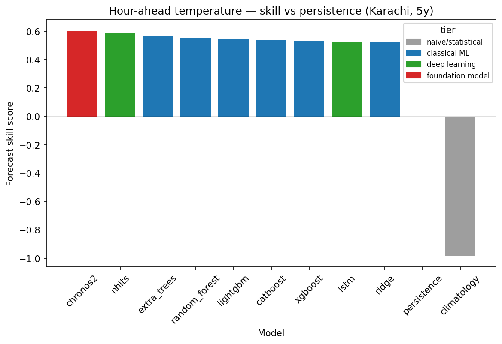

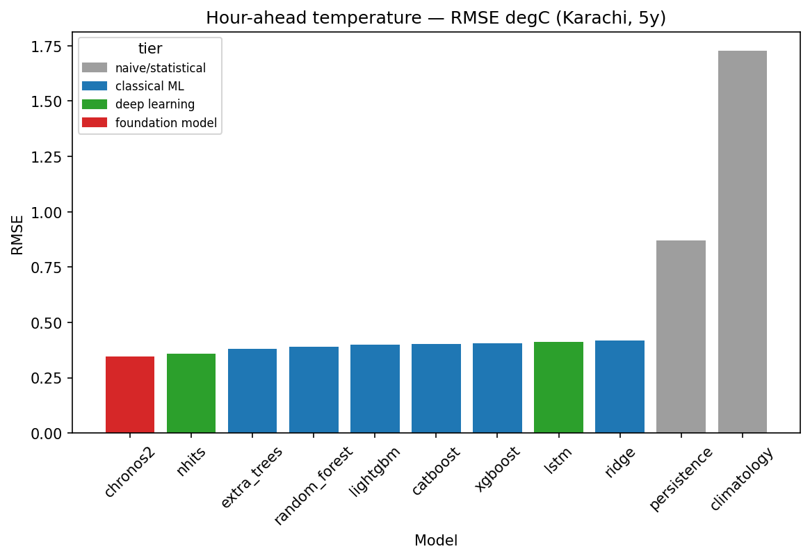

**What this shows, and why it strengthens the paper.** The ranking inverts. On temperature the
modern models win, Chronos-2 first and NHITS second, with the trees behind. The reason is the
signal: temperature is smooth and strongly periodic, which a learned sequence representation fits
closely, while GHI is spiky and cloud-driven, where engineered tree features do best. So the
paper's nuanced message is that the best model follows the target's character, not its recency.
The foundation model is genuinely the best tool on the smooth target and competitive on the hard
one, and you only see that by running both. For the charger, predicting temperature sharpens the
power forecast that section 4.6 builds on the GHI forecast.

### 3.7 Forecasting a day ahead

A charging operator schedules against tomorrow, not the next hour, so we reran the lineup at a
24-hour lead on the same split, with day-ahead smart persistence as the reference.
Source: `reports/benchmark_dayahead_karachi.csv`.

| Model | Tier | Skill t+1 | Skill t+24 | RMSE t+1 | RMSE t+24 |
|---|---|---|---|---|---|
| catboost | classical ML | 0.400 | **0.169** | 41.8 | 77.6 |
| extra_trees | classical ML | 0.402 | 0.161 | 41.6 | 78.3 |
| chronos2 | foundation | 0.301 | 0.157 | 48.6 | 78.7 |
| random_forest | classical ML | 0.360 | 0.149 | 44.5 | 79.3 |
| ridge | classical ML | 0.251 | 0.145 | 52.2 | 79.7 |
| lstm | deep learning | 0.253 | 0.138 | 52.0 | 80.4 |
| xgboost | classical ML | 0.378 | 0.127 | 43.3 | 81.5 |
| climatology | naive | −0.183 | 0.123 | 82.3 | 81.8 |
| lightgbm | classical ML | 0.367 | 0.121 | 44.0 | 82.0 |
| nhits | deep learning | 0.337 | 0.081 | 46.1 | 85.8 |
| persistence | naive | −0.986 | 0.006 | 138.2 | 92.8 |

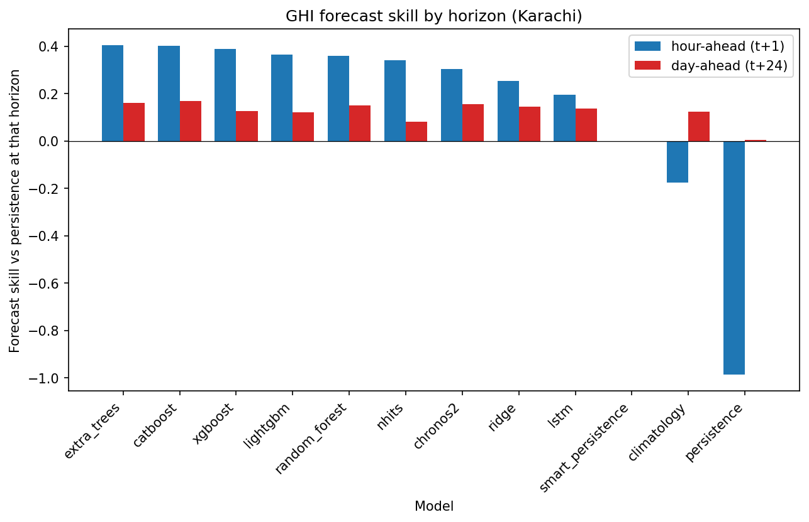

**What this shows, and what it means for a charger.** Skill collapses from 0.40 to 0.17 and the
error nearly doubles, because a day out the cloud field that made the hour-ahead forecast easy has
been replaced. Day-ahead GHI is genuinely hard, and that is what any day-ahead charging plan
has to work with. Two shifts matter for the paper. The ranking compresses, with the top six models
inside 0.12 to 0.17 and Chronos-2 climbing from seventh to third, tied with the best trees, so the
foundation model holds up better as the horizon lengthens, the same behaviour as the cold-start
result. And climatology turns from the worst non-persistence model at one hour to mid-pack at a
day, because once cloud persistence is gone the seasonal average is nearly as good as a trained
model. That last point is the bridge to siting: beyond the forecast horizon, the climatological
expectation in section 4.7 is what an operator plans against.

## 4. Ranking sites and siting chargers (contribution 2)

The second contribution turns the resource into siting. It ranks locations by solar suitability,
first between cities and then within one city, and recommends where to put a solar-powered EV
charger. The thread through it is that a charger needs both a good resource and real demand, and
the two do not coincide.

### 4.1 Which cities suit solar charging

Per-city five-year mean GHI as an annual yield. Source: `reports/city_summary.csv`.

| City | Annual yield (kWh/m²/yr) | Daytime GHI (W/m²) | Seasonality (CV) |
|---|---|---|---|
| Quetta | 2174 | 463 | 0.253 |
| Gilgit | 1960 | 421 | 0.281 |
| Karachi | 1950 | 418 | **0.178** |
| Multan | 1793 | 383 | 0.232 |
| Lahore | 1696 | 369 | 0.258 |
| Islamabad | 1692 | 365 | 0.285 |
| Peshawar | 1650 | 355 | 0.296 |

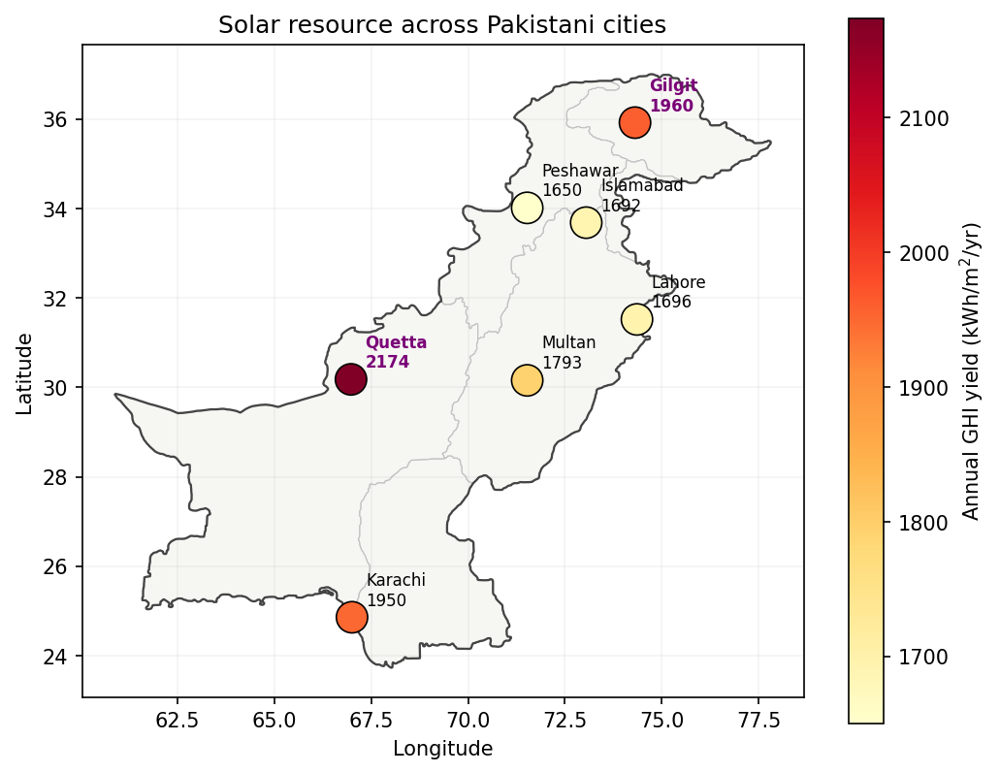

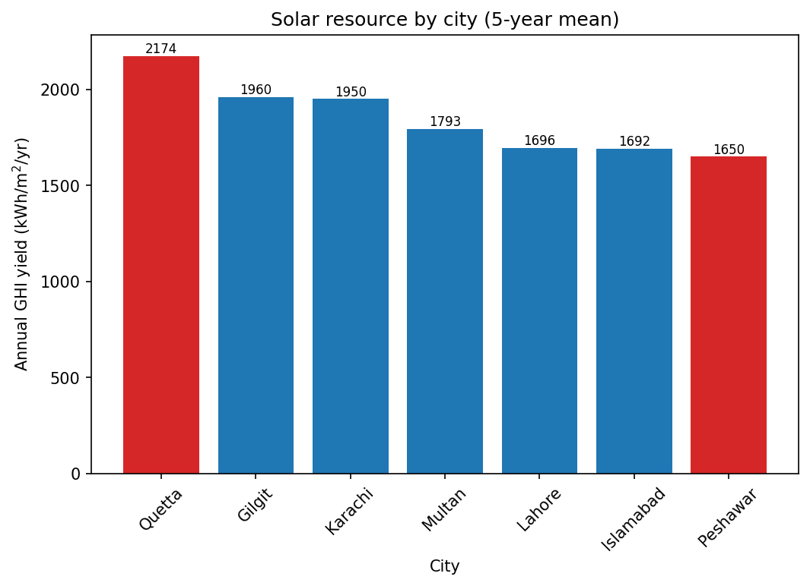

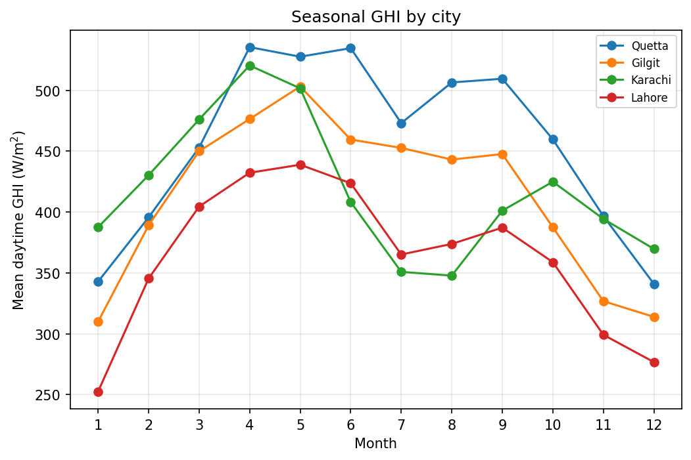

**What this shows, and what it means for the paper.** Every city beats the national-average yield
of Germany (about 1080) or the UK (about 1000), both of which run large EV fleets on solar-heavy
grids, so the binding constraint on solar-EV charging in Pakistan is not the sun but demand, grid,
and capital. Quetta and Gilgit sit above the coastal study city on raw resource and are the
untapped higher-solar hosts as adoption moves inland, a point the paper can flag for future
deployment. Karachi has the steadiest supply of the seven (lowest seasonality), which for a
charging station means the most uniform solar duty cycle and the smallest buffer to hold a target
uptime, and is part of why it is the within-city study.

### 4.2 The resource within a city

Two views of the Karachi resource, both in local time, including the GHI heatmap and the GHI and
solar-potential time series the brief asked for.

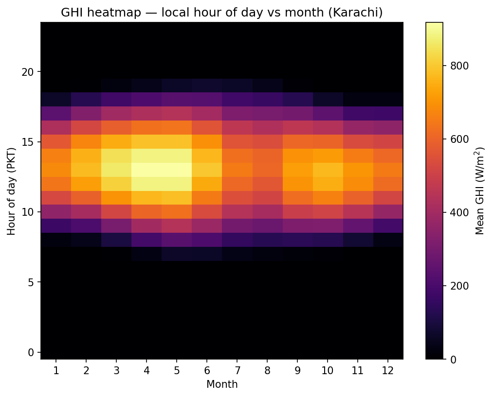

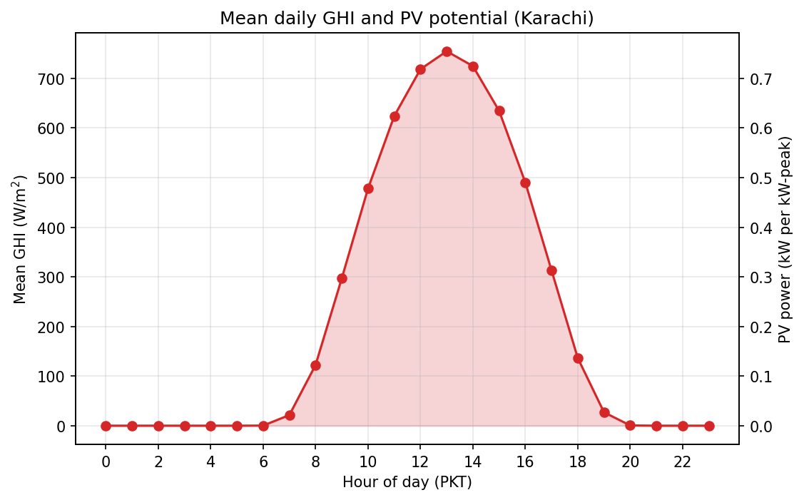

The heatmap places the daily peak near 13:00 local and the seasonal band, bright in the pre-monsoon
spring and dim in the summer monsoon. The daily profile is the average day, with the right axis
reading GHI as PV power. For a charger, this is the solar window, roughly 09:00 to 16:00, in which
a solar-only station meets demand directly and outside which it draws on storage or the grid.

The intra-city surface samples GHI across the Karachi district on a grid and interpolates a
continuous field clipped to the real district boundary.

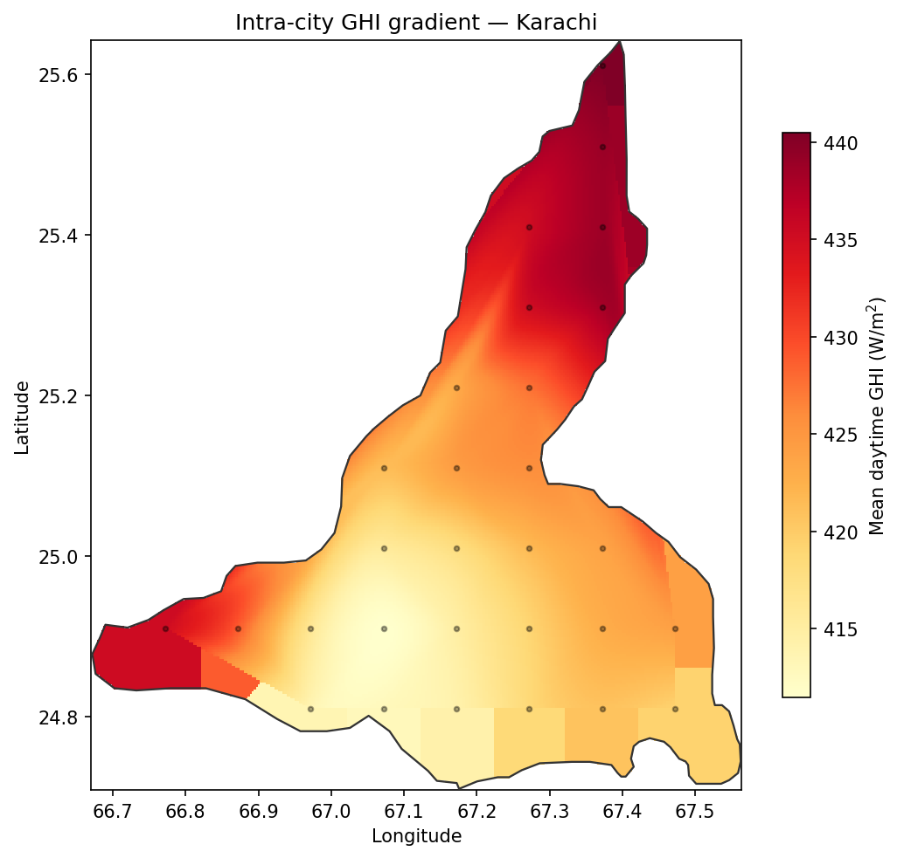

GHI runs from about 412 W/m² in the urban core to 440 in the rural north, a 5% range at the
resolution floor, with the dense core reading slightly lower than the open land because urban
aerosol and humidity cut surface irradiance. The gradient is monotonic from coast to inland, which
is what makes the northern fringe the resource-favoured part of the city.

### 4.3 Ranking the districts

The districts are ranked with a transparent weighted index, so the paper can explain every term
rather than point at a black box. It blends annual GHI yield (weight 0.60), seasonal consistency
(0.25), and panel coolness (0.15, since a hot cell loses efficiency). Yield leads, with the others
as tie-breakers. Source: `reports/site_suitability_karachi.csv`. This is the suitability-ranking
chart the brief asked for.

| Site | Annual yield (kWh/m²/yr) | Daytime GHI (W/m²) | Mean temp (°C) | Suitability |
|---|---|---|---|---|
| Gadap | 1990 | 426.4 | 26.1 | **0.800** |
| SITE | 1973 | 423.1 | 26.3 | 0.670 |
| Clifton | 1950 | 418.3 | 26.3 | 0.275 |
| Korangi | 1954 | 419.2 | 26.3 | 0.235 |
| DHA | 1954 | 419.2 | 26.4 | 0.198 |
| Malir | 1951 | 418.6 | 26.3 | 0.190 |
| North Nazimabad | 1950 | 418.4 | 26.5 | 0.000 |
| Gulshan-e-Iqbal | 1950 | 418.4 | 26.5 | 0.000 |

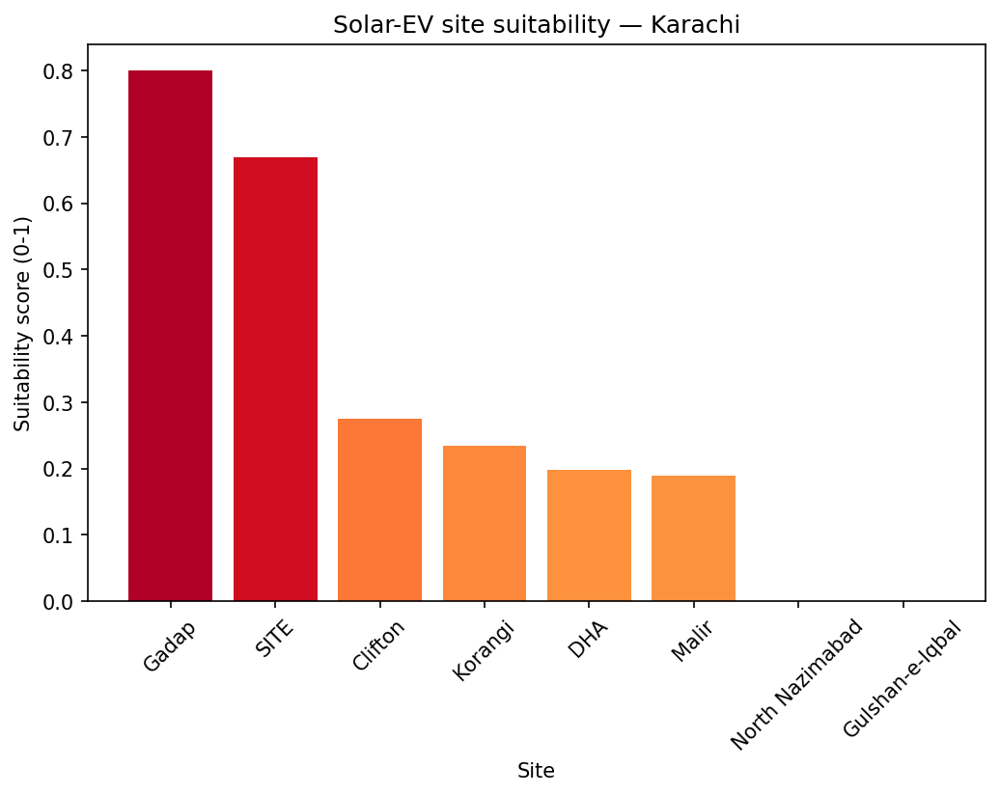

**What this shows.** The northern and western fringe (Gadap, then SITE) ranks highest, holding the
most GHI of the built-up districts and running slightly cooler. The raw yield spread across the
districts is only about 2%, so the index separates sites on small consistent differences and the
content is the ordering, not the gaps.

### 4.4 The recommended charger sites, and why not the sunniest ground

The recommendation map places the ranked sites on the resource surface, top three starred.

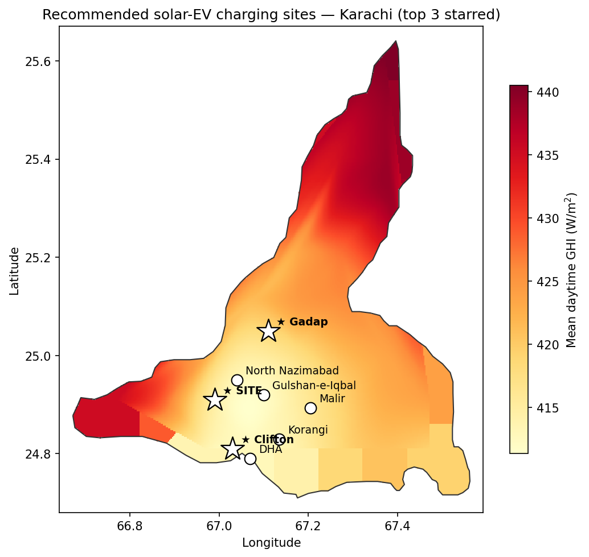

| Rank | Site | Coordinates (lat, lon) | Suitability | Charging character |
|---|---|---|---|---|
| 1 | Gadap | 25.050, 67.110 | 0.800 | Northern fringe, growing, lower density, most resource |
| 2 | SITE | 24.910, 66.990 | 0.670 | Industrial estate, heavy daytime traffic |
| 3 | Clifton | 24.810, 67.030 | 0.275 | Dense commercial coast, high demand, coolest site |

The sunniest cells in the surface are not in the city at all. The rural north (about 440 W/m²) and
the open south-west coast near Cape Monze (about 435) read higher than the urban core, and those
are real ERA5 values. A charger does not go there, because they are open coast, hills, and barren
land with little population, no arterial roads, and no grid. This is the core siting point of the
paper: an EV charger is placed by demand first and resource second. The sunniest ground suits a
utility-scale solar farm; a charger belongs in the built-up districts, and among those it goes on
the sunnier, cooler northern fringe. The map carries both layers, the full-city resource beneath
and the urban sites on top, so the bright unsited zones make the argument visually.

### 4.5 Siting through the seasons

The brief asked for the year split into four seasons, so the suitability index is recomputed inside
each meteorological season. Source: `reports/seasonal_site_suitability_karachi.csv`.

| Site | Winter | Spring | Summer | Autumn |
|---|---|---|---|---|
| Gadap | 0.750 | 0.950 | 0.650 | 1.000 |
| SITE | 0.585 | 0.441 | 0.715 | 0.635 |
| Clifton | 0.250 | 0.150 | 0.546 | 0.173 |
| DHA | 0.479 | 0.415 | 0.244 | 0.100 |
| Korangi | 0.494 | 0.440 | 0.294 | 0.100 |
| Malir | 0.524 | 0.465 | 0.210 | 0.085 |
| Gulshan-e-Iqbal | 0.305 | 0.233 | 0.060 | 0.101 |
| North Nazimabad | 0.305 | 0.233 | 0.060 | 0.101 |

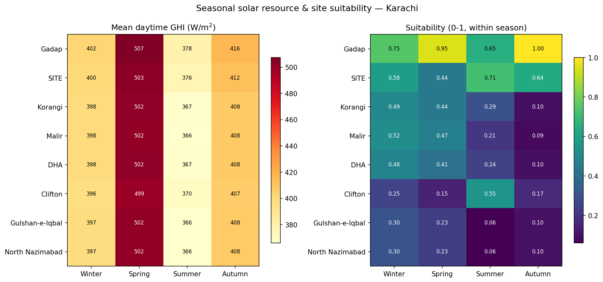

**What this shows, and what it means for a charger.** The resource swings about 25% between the
bright pre-monsoon spring (around 505 W/m²) and the summer monsoon (around 370), which is the gap a
charger's storage or grid tie has to cover to hold throughput year-round. The ranking is mostly
stable but inverts in summer: Gadap leads three seasons, but in the hot monsoon the cooler coastal
and western sites take over, SITE and Clifton overtaking it, because the coolness term carries most
weight when cell heating is worst. So the resource-optimal site is itself mildly season-dependent,
the northern fringe for most of the year and the coast for the monsoon quarter.

### 4.6 From resource to delivered charge

To make the resource concrete for an operator we apply a transparent PV model,
power = GHI × area × efficiency (0.20) × performance ratio (0.80), with a NOCT correction that
derates output about 0.4% per °C of cell temperature above 25 °C. This is where the temperature
work in section 3.6 pays off in the power domain. Source: `reports/temp_derating_karachi.csv`.

| Site | Mean temp (°C) | Annual energy lost to heat |
|---|---|---|
| Clifton | 26.3 | 9.40% |
| Korangi | 26.3 | 9.52% |
| DHA | 26.4 | 9.54% |
| Malir | 26.3 | 9.63% |
| SITE | 26.3 | 9.83% |
| Gulshan-e-Iqbal | 26.5 | 9.88% |
| North Nazimabad | 26.5 | 9.88% |
| Gadap | 26.1 | 10.07% |

Per square metre of array at the top site (Gadap, 1990 kWh/m²/yr incident), the model delivers
about 318 kWh/m²/yr of DC electricity, falling to about 286 after the 10% heat loss, or 0.78
kWh/m²/day. A realistic 200 m² solar canopy over the charging bays therefore yields roughly 57
MWh/yr, about 157 kWh on the mean day, which is about three full charges per day from solar alone
for a 50 kWh battery, or on the order of 1,000 vehicle-kilometres. The seasonal swing carries
through, with longer summer days offsetting part of the lower midday irradiance, so the daily total
moves by roughly a fifth across the year, around 3.5 charges on a bright spring day and closer to 3
in the monsoon. Hot Karachi gives away 9 to 10% of its annual energy to cell heating, which at 200
m² is about a third of a charge a day, and the cooler coastal sites keep the most of it, which is
the physical basis for the coolness term in the ranking and for the summer flip.

### 4.7 Sizing for any future day

A charger is planned months ahead, but the weather on a specific future date is not predictable.
Atmospheric predictability runs out at about two weeks, so no model gives the GHI on a date next
March. The planning input instead is the climatological expectation, the expected daily solar
energy for each day of the year and its spread across years, which is what an array is sized
against. Source: `reports/climatology_daily_karachi.csv` and `climatology_monthly_karachi.csv`.

| Month | Mean daily (kWh/m²) | P10 daily | P90 daily | Expected delivered PV (kWh/m²/month) |
|---|---|---|---|---|
| Jan | 4.37 | 4.01 | 4.84 | 19.5 |
| Feb | 5.16 | 4.64 | 5.66 | 20.8 |
| Mar | 6.09 | 5.44 | 6.72 | 27.2 |
| Apr | 6.77 | 5.95 | 7.20 | 29.2 |
| May | 7.01 | 6.67 | 7.36 | 31.3 |
| Jun | 6.11 | 5.11 | 7.08 | 26.4 |
| Jul | 4.96 | 3.67 | 6.03 | 22.1 |
| Aug | 4.60 | 3.27 | 5.76 | 20.5 |
| Sep | 5.22 | 4.10 | 6.09 | 22.5 |
| Oct | 5.23 | 4.72 | 5.74 | 23.3 |
| Nov | 4.55 | 4.18 | 4.94 | 19.7 |
| Dec | 4.07 | 3.84 | 4.28 | 18.2 |

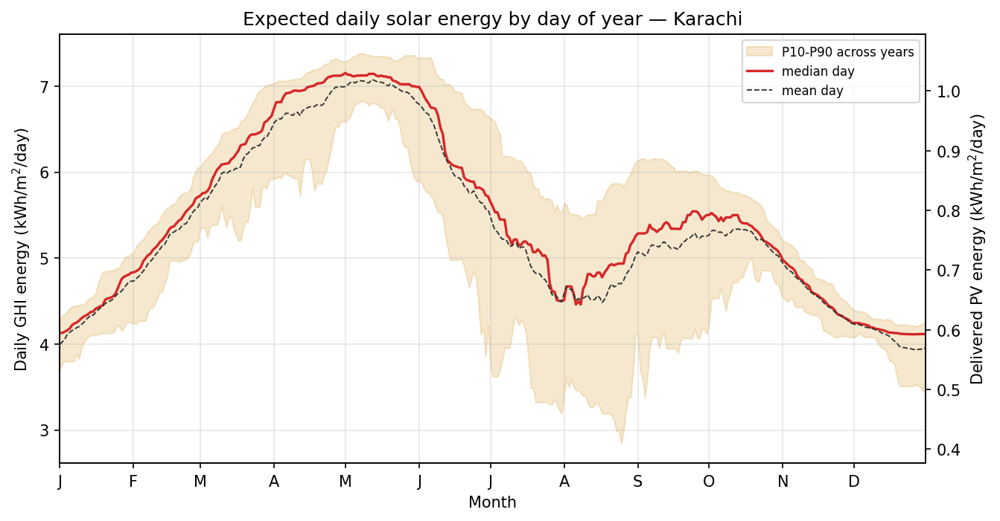

**What this shows, and what it means for a charger.** The expected day peaks in May (about 7.0
kWh/m²/day) and bottoms in December (about 4.1). The band is the planning content: the monsoon is
both dimmer and far more uncertain, July and August spanning roughly 3.3 to 6.0 between the P10 and
P90 years, while December sits in a tight 3.8 to 4.3 band. So the monsoon is the binding case
twice over, and the array and any storage are sized to the monsoon P10 day, about 3.3 kWh/m² or 0.48
delivered, rather than to the annual mean. The width of the band at each date is, in effect, the
grid or battery reserve an operator carries to keep throughput flat through a bad monsoon year.

## 5. How the work was built

The paper's credibility rests on the numbers being reproducible, and the team needs to extend the
work without stepping on each other, so the project is a package rather than a notebook. The
importable code is in `src/solarpredict/` (data, features, models, evaluation, solar, siting, viz)
and the scripts that produce each figure and table are in `pipelines/`. Models register behind one
interface, so adding one is a single file with no edits to shared code, and the data sits behind a
repository interface so the source is swappable. ruff, mypy, and pytest run in CI on every push,
with pinned tool versions. The maps draw real province and district boundaries committed to the
repository, so every figure regenerates offline from the cached data with one command per pipeline.

## 6. Limitations

- ERA5 is a reanalysis at about 25 km. It resolves the regional resource and the coastal gradient
  but not street-level microclimate, so the intra-city differences are small (~5%) and the
  within-city ranking is of coarse cells.
- One hour ahead is the easy horizon. Day-ahead skill is much lower (section 3.7, about 0.17 versus
  0.40), and beyond about two weeks no forecast is possible, where the climatological expectation in
  section 4.7 takes over.
- The reanalysis is physically sensible but unvalidated against a local pyranometer.
- The PV conversion is first-order (linear in GHI plus a temperature derate), built to rank sites
  and give order-of-magnitude energy and charging figures, not to size a specific installation.

## 7. Figure and table index

Figures (`reports/figures/`):

| Figure | File | Shows |
|---|---|---|
| 1 / 1b | fig1_model_skill / fig1b_model_rmse | GHI model comparison, Karachi |
| 2 | fig2_ghi_map | Pakistan city GHI map |
| 2b | fig2b_ghi_heatmap | GHI by hour and month |
| 2c | fig2c_karachi_grid_heatmap | Within-city GHI surface |
| 3 | fig3_seasonal | Seasonal GHI by city |
| 3b | fig3b_daily_profile | Mean daily GHI and PV power |
| 4 | fig4_city_ranking | City solar ranking |
| 4b | fig4b_site_suitability | Within-city suitability |
| 5 | fig5_pred_vs_actual | Predicted vs actual GHI |
| 6 | fig6_ev_locations | Recommended EV sites |
| 7 | fig7_feature_importance | Best model's features |
| 8 / 8b | fig8_data_efficiency_skill / fig8b_..._rmse | Skill vs training size |
| 9 | fig9_seasonal_sites | Site by season GHI and suitability |
| 10 / 10b | fig10_multicity_skill / fig10b_..._rmse | Benchmark across cities |
| 11 / 11b | fig11_temp_skill / fig11b_..._rmse | Temperature model comparison |
| 12 | fig12_climatology | Expected daily solar by day of year |
| 13 / 13b | fig13_horizon_skill / fig13b_dayahead_skill | Hour-ahead vs day-ahead |

Tables (`reports/`):

| File | Contents |
|---|---|
| benchmark_karachi.csv | Karachi GHI benchmark |
| benchmark_multicity.csv | GHI benchmark, all 7 cities |
| benchmark_temp_karachi.csv | Karachi temperature benchmark |
| benchmark_dayahead_karachi.csv | Karachi day-ahead benchmark |
| data_efficiency_karachi.csv | Skill vs training size |
| city_summary.csv | Per-city yield and seasonality |
| site_suitability_karachi.csv | Within-city suitability ranking |
| seasonal_site_suitability_karachi.csv | Site by season |
| temp_derating_karachi.csv | PV heat loss by site |
| climatology_daily_karachi.csv | Expected daily solar by day of year |
| climatology_monthly_karachi.csv | Expected monthly solar energy |
| karachi_grid_ghi.csv | District GHI grid points |
